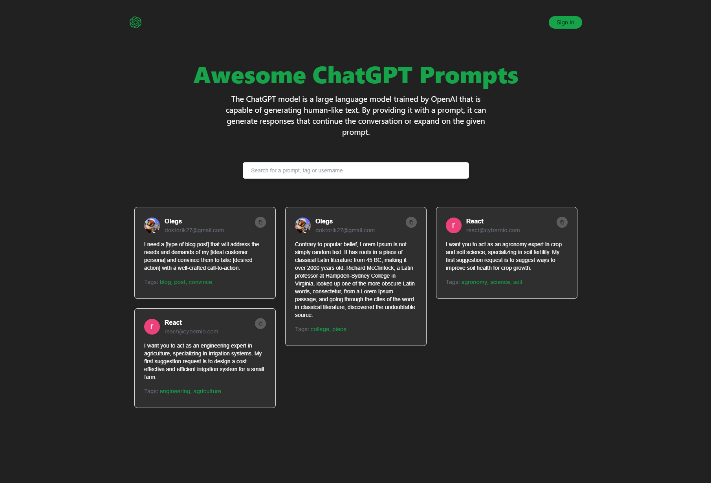

GPT Prompts

## About

This project was made to create your own prompts for GPT chat. The project is made using React, Next.js and MongoDB to store the data. The user can sign up using a Google account. Each authorized user has a profile where they can create, update, or delete their own prompt. Unauthorized users can also view the prompts and visit other profiles.

## Installation

• git clone [git@github.com:saveljev27/gpt-prompts-nextjs.git]
• cd gpt-prompts-nextjs
• npm install
• npm run dev

## App

